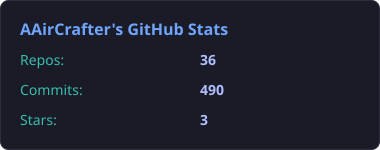
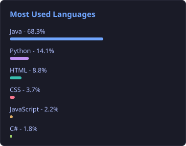
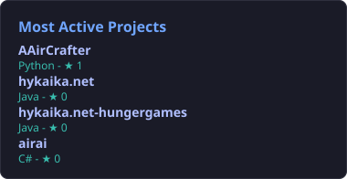

<h1 align="center">Hi, ich bin AAirCrafter</h1> 

  
  
  
  

---

   
  &nbsp;&nbsp;&nbsp; 
   
  &nbsp;&nbsp;&nbsp; 
  
  &nbsp;&nbsp;&nbsp; 
  
  &nbsp;&nbsp;&nbsp; 
   
  &nbsp;&nbsp;&nbsp; 
  

&nbsp;&nbsp;&nbsp;

  <b>Currently Learning</b>
    
  
  &nbsp;&nbsp;&nbsp;
  
  &nbsp;&nbsp;&nbsp;
  

&nbsp;&nbsp;&nbsp; 
<!--

  
  &nbsp;&nbsp;&nbsp;
  

-->
---

  
  

  

&nbsp;&nbsp;&nbsp; 
&nbsp;&nbsp;&nbsp; 

  

